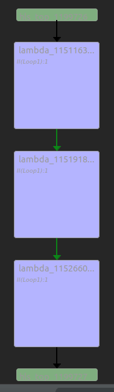
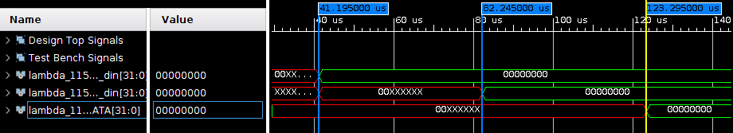

## Filter Chain
- generated by new AnyHLS
   - source &lt;vivado(Xilinx) installation dir&gt;/&lt;Vivado version&gt;/settings64.sh
   - ``` vivado_hls -f run_hls_top.tcl ```

- tested with *vivado 2019.1*



